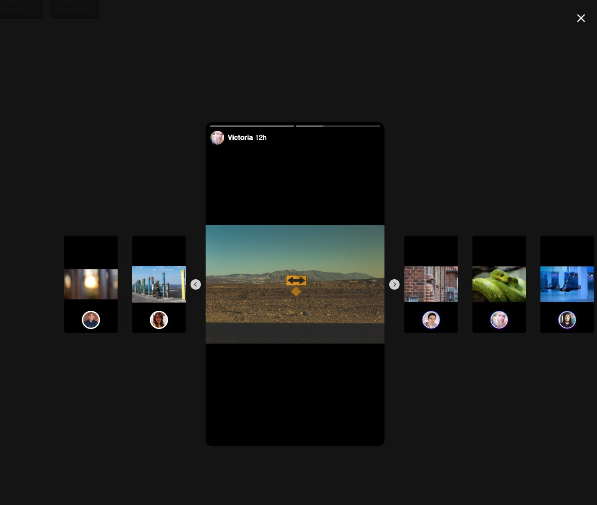

# vue-stories-instagram

<br>




## Simple usage
```vue
<template>
  <Stories :stories="items" />
</template>

<script>
import Stories from "vue-stories-instagram";

export default {
  components: { Stories },
  data: () => ({
    items: [
      {
        username: "Jessica Valentine",
        picture: "https://randomuser.me/api/portraits/men/61.jpg",
        time: "12h",
        images: [
          {
            url: "https://randomwordgenerator.com/img/picture-generator/57e7d4414d51a814f1dc8460962e33791c3ad6e04e50744172287cd09e49cd_640.jpg",
            viewed: true,
          },
          {
            url: "https://randomwordgenerator.com/img/picture-generator/55e4d5474350b10ff3d8992cc12c30771037dbf852547849712a73d5954d_640.jpg",
            viewed: true,
          },
          {
            url: "https://randomwordgenerator.com/img/picture-generator/54e2d3414950a914f1dc8460962e33791c3ad6e04e5074417d2e72d29e4ecd_640.jpg",
            viewed: false,
          },
          {
            url: "https://cdn.videvo.net/videvo_files/video/free/2014-12/large_watermarked/Metal_Wind_Chimes_at_Sunset_preview.mp4",
            viewed: false,
            type: 'video',
          },
        ],
      },
    ]
  })
};
</script>
```

### Props
| Property             | Type             | Default  | Description                                                        |
|----------------------|------------------|----------|--------------------------------------------------------------------|
| `stories`            | [Array]          | required | An array of story objects                                          |
| `duration`           | Number           | 3000     | Story duration in milliseconds                                     |
| `currentIndex`       | Number           | 0        | Select story by index                                              |
| `showInnerContent`   | Boolean          | false    | Inner story content (scoped-slot)                                  |
| `showOuterContent`   | Boolean          | false    | Outer story content (scoped-slot)                                  |
| **Events**           |                  |          |                                                                    |
| `allStoriesEnd`      | Function()       | -        | Callback when all stories ends                                     |
| `сurrentImageEnd`    | Function(index)  | -        | Callback when a current story image ends                           |
| `сurrentAllImagesEnd`| Function(index)  | -        | Callback when a current story all images ends                      |
| `closeStories`       | Function()       | -        | Callback when click on close icon                                  |

### Story Object
| Property   | Description                                                          |
|------------|----------------------------------------------------------------------|
| `username` | The user name.                                                       |
| `picture`  | The user pisture.                                                    |
| `time`     | The time when the story was added.                                   |
| `images`   | The array of images or video.                                        |
| `url`      | The url of the resource, image or video.                             |
| `viewed`   | Optional. marked story images as viewed                              |
| `type`     | Optional. Type of the story. `'image' \| 'video'`                    |


## With custom slot
```vue
<template>
  <Stories :stories="items"
           :showInnerContent="true"
           :showOuterContent="true" >

    <template v-slot:innerContent="{ story }">
      <div class="property" v-if="story.property">
        <div class="property__image">
          
        </div>
        <div class="property__description">
          <div class="property__price">{{ story.property.price }}</div>
          <div class="property__location">{{ story.property.location }}</div>
        </div>
      </div>
    </template>

    <template v-slot:outerContent="{ story }">
      <div v-if="story.info" class="story-info">
        <div class="story-info__description">
          <div class="story-info__price">{{ story.info.price }}</div>
          <div class="story-info__location">{{ story.info.location }}</div>
        </div>
        <ul class="actions">
          <li class="actions__item">
            
            <div class="actions__text">{{ story.info.comment }}</div>
          </li>
          <li class="actions__item">
            
            <div class="actions__text">{{ story.info.like }}</div>
          </li>
        </ul>
      </div>
    </template>
  </Stories>
</template>

<script>
import Stories from "vue-insta-stories";
export default {
  components: { Stories },
  data: () => ({
    items: [  {
      username: "Jessica Valentine",
      picture: "https://randomuser.me/api/portraits/men/61.jpg",
      time: "12h",
      images: [
        {
          url: "https://randomwordgenerator.com/img/picture-generator/57e7d4414d51a814f1dc8460962e33791c3ad6e04e50744172287cd09e49cd_640.jpg",
          viewed: true,
        },
        {
          url: "https://randomwordgenerator.com/img/picture-generator/55e4d5474350b10ff3d8992cc12c30771037dbf852547849712a73d5954d_640.jpg",
          viewed: true,
        },
        {
          url: "https://randomwordgenerator.com/img/picture-generator/54e2d3414950a914f1dc8460962e33791c3ad6e04e5074417d2e72d29e4ecd_640.jpg",
          viewed: false,
        },
        {
          url: "https://cdn.videvo.net/videvo_files/video/free/2014-12/large_watermarked/Metal_Wind_Chimes_at_Sunset_preview.mp4",
          viewed: false,
          type: 'video',
        },
      ],
      property: {
        picture: 'https://randomwordgenerator.com/img/picture-generator/57e7d4414d51a814f1dc8460962e33791c3ad6e04e50744172287cd09e49cd_640.jpg',
        price: '$599,000',
        location: '415 SW 30th Rd, Miami, FL',
      },
      info: {
        price: '$599,000',
        location: '415 SW 30th Rd, Miami, FL',
        comment: '125',
        like: '400',
      },
    }]
  })
};
</script>
```